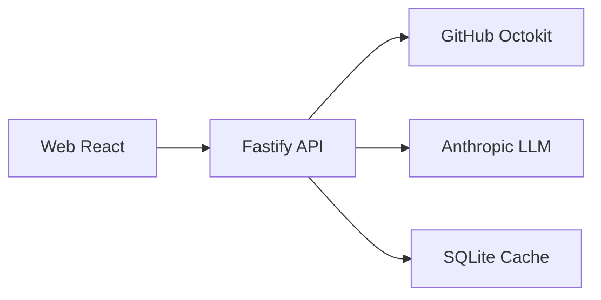

# Repo Explainer
Interactive architecture explanations for GitHub repos.

*Demo GIF Placeholder*

## Features
- Dependency Graph with cyclic dependency detection
- AI-Powered Explanations for Repos and Files
- Automatic Tech Stack Detection

## Architecture

## Quick Start
1. `cp .env.example .env` and add API keys.
2. `docker compose up` OR `npm install && npm run dev`
