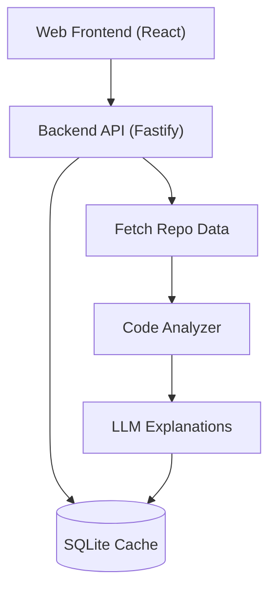

<div align="center"> 
  <h1>🗺️ RepoAtlas</h1>
  <p>Map any GitHub repository in seconds.</p>
  <p>Paste a repo URL and get an interactive architecture map: dependency graph, tech stack detection, plain-English explanations for every module, and a suggested reading order for new contributors.</p>
  <!-- Replace with a real demo GIF --> 
   
</div> 

## Table of Contents
- [Why RepoAtlas?](#why-repoatlas)
- [Features](#features)
- [Quick Start](#quick-start)
- [Configuration](#configuration)
- [How It Works](#how-it-works)
- [Architecture](#architecture)
- [Tech Stack](#tech-stack)
- [API Reference](#api-reference)
- [Supported Languages](#supported-languages)
- [Limits and Design Decisions](#limits-and-design-decisions)
- [Project Structure](#project-structure)
- [Development](#development)
- [Roadmap](#roadmap)
- [Contributing](#contributing)
- [FAQ](#faq)
- [License](#license)

## Why RepoAtlas?
Opening an unfamiliar codebase is slow. You scroll through folders, guess which files matter, and jump between imports trying to build a mental model. Most of that work is mechanical.

RepoAtlas does the mechanical part for you. It reads the repository, works out how the files depend on each other, ranks the files that matter most, and explains each one, so you can go from "what is this project?" to "where do I start?" in under a minute.

**Good for:**
- 🧑‍💻 New contributors getting oriented in an open-source project
- 👥 New hires onboarding to a company codebase
- 🔍 Reviewers and auditors who need a fast overview of what a repo contains
- 📚 Students learning from real-world projects

## Features
| Feature | Description |
|---|---|
| 🕸️ Interactive dependency graph | Zoomable, pannable graph of file relationships built with React Flow. Nodes are sized and colored by importance. |
| 🧠 Plain-English explanations | A project summary, architecture overview, and per-file explanations, grounded in the actual code. |
| 🧭 Onboarding guide | A suggested reading order (top files with a one-line reason each), driven by graph importance scores. |
| 🧱 Tech stack detection | Languages, frameworks, package manager, test framework, CI, and Docker usage, detected automatically. |
| 🔁 Circular dependency detection | Cycles are found and highlighted in red in the graph. |
| 📂 File tree and search | Collapsible tree with search to jump to any file in the graph. |
| ⚡ Smart caching | Results are cached in SQLite by repo and commit SHA, so a repo is never analyzed twice. |
| 🔌 Works without an API key | A built-in mock provider lets you run and test the whole pipeline for free. |
| 📤 Export | Download the graph as PNG or SVG and the summary as Markdown. |
| 🔗 Shareable links | Every analysis gets a URL like `/r/:owner/:repo`. |
| 🌗 Dark and light themes | Dark by default, with a toggle. |

## Quick Start
### Option 1: Docker (recommended)
```bash
git clone https://github.com/adwaith620/RepoAtlas.git 
cd RepoAtlas 
cp .env.example .env 
docker compose up
```
Open http://localhost:5173 and paste a GitHub repo URL.

### Option 2: Run locally
Prerequisites: Node.js 20 or newer and npm 9 or newer.
```bash
git clone https://github.com/adwaith620/RepoAtlas.git 
cd RepoAtlas 
# Install all workspace dependencies 
npm install 
# Set up environment variables 
cp .env.example .env 
# Start the web app and API server together 
npm run dev
```

| Service | URL |
|---|---|
| Web app | http://localhost:5173 |
| API server | http://localhost:3001 |
| Health check | http://localhost:3001/api/health |

*No API key? No problem. With no ANTHROPIC_API_KEY set, RepoAtlas falls back to the mock provider. You still get the full graph, tech stack detection, and reading order. Only the natural-language summaries are placeholder text.*

## Configuration
Copy `.env.example` to `.env` and adjust as needed.

| Variable | Required | Default | Description |
|---|---|---|---|
| `ANTHROPIC_API_KEY` | No | none | Enables real LLM explanations. Without it, the mock provider is used. |
| `GITHUB_TOKEN` | No | none | Raises the GitHub API rate limit from 60 to 5,000 requests per hour. Strongly recommended. |
| `PORT` | No | 3001 | Port for the API server. |
| `WEB_ORIGIN` | No | `http://localhost:5173` | Allowed CORS origin for the web app. |
| `DATABASE_PATH` | No | `./data/cache.sqlite` | Location of the SQLite cache file. |
| `MAX_FILES` | No | 400 | Maximum number of files analyzed per repo. |
| `MAX_FILE_SIZE_KB` | No | 200 | Files larger than this are skipped. |

**Security**: never commit your `.env` file. It is already listed in `.gitignore`.

## How It Works
RepoAtlas runs each analysis through a five-stage pipeline:

```text
GitHub URL 
    │ 
    ▼ 
┌──────────┐    ┌───────────┐    ┌─────────┐    ┌───────────┐    ┌─────────┐ 
│  FETCH   │──▶ │  ANALYZE  │──▶ │  GRAPH  │──▶ │  EXPLAIN  │──▶ │   API   │ 
└──────────┘    └───────────┘    └─────────┘    └───────────┘    └─────────┘ 
 tree + files     imports +      nodes, edges   LLM summaries    JSON to the 
 via GitHub       tech stack     importance,    (top files       web app
 REST API         detection      cycles         eager, rest lazy)
```

- **Fetch**: Reads the repo's file tree and file contents through the GitHub REST API. It never clones the repo. Noise (build output, dependencies, lockfiles, binaries, minified files) is filtered out, and the result is capped for very large repos.
- **Analyze**: Detects the tech stack from manifest files, extracts import statements from source files, and resolves relative imports to real files in the repo. External packages are recorded separately as external dependencies.
- **Graph**: Builds nodes and edges, computes in-degree, out-degree, and an importance score per file, clusters files by folder, and detects circular dependencies.
- **Explain**: Generates a project summary, an architecture overview, and a reading order. The most important ~30 files are explained up front and the rest are explained lazily when you click them. Prompts instruct the model to stay grounded in the provided code and to say "unclear from the code" instead of guessing.
- **API**: Serves the result to the React frontend. Everything is cached by owner/repo/commit-sha.

## Architecture


**Design principles**
- Each module has a single responsibility with typed inputs and outputs.
- Shared TypeScript types live in `/shared` and are used by both the web app and the server.
- The LLM is behind an `LLMProvider` interface, so you can swap providers or run fully offline with the mock.
- Every failure mode (invalid URL, private repo, rate limit, oversized repo, empty repo) produces a clear message in the UI, never a crash.

## Tech Stack
| Layer | Technology |
|---|---|
| Frontend | React 18, TypeScript, Vite, Tailwind CSS |
| Graph visualization | React Flow (@xyflow/react) |
| Backend | Node.js 20, TypeScript, Fastify |
| Repo access | GitHub REST API (Octokit) |
| Static analysis | Import parsing for JS/TS and Python |
| LLM | Anthropic API (pluggable via LLMProvider) |
| Cache | SQLite (better-sqlite3) |
| Testing | Vitest |
| Tooling | ESLint, Prettier, npm workspaces |
| Deployment | Docker, Docker Compose, GitHub Actions |

## API Reference
**Base URL:** `http://localhost:3001`

| Method | Endpoint | Description |
|---|---|---|
| GET | `/api/health` | Health check. Returns `{ "ok": true }`. |
| POST | `/api/repo/meta` | Repo metadata: default branch, description, stars, languages, latest commit SHA. |
| POST | `/api/repo/tree` | Filtered file tree, plus a truncated flag if the file cap was hit. |
| POST | `/api/analyze` | Full analysis: tech stack, graph, external dependencies, cycles. |
| POST | `/api/explain/repo` | Project summary, architecture overview, and onboarding reading order. |
| POST | `/api/explain/file` | Explanation of a single file and how it relates to its neighbors. |

**Example**
```bash
curl -X POST http://localhost:3001/api/analyze \
  -H "Content-Type: application/json" \
  -d '{ "url": "https://github.com/sindresorhus/is" }'
```

**Example response (abridged)**
```json
{ 
  "meta": { "owner": "sindresorhus", "repo": "is", "sha": "abc123", "defaultBranch": "main" }, 
  "techStack": { "languages": ["TypeScript"], "packageManager": "npm", "testFramework": "ava", "ci": ["GitHub Actions"] }, 
  "graph": { "nodes": [ ... ], "edges": [ ... ] }, 
  "externalDeps": ["..."], 
  "cycles": [], 
  "truncated": false 
}
```

Error responses use a consistent shape:
```json
{ "error": "RATE_LIMIT", "message": "GitHub API rate limit reached. Add a GITHUB_TOKEN to continue." }
```

| Error code | Meaning |
|---|---|
| INVALID_URL | The input is not a valid GitHub repository URL. |
| REPO_NOT_FOUND | The repo does not exist or is private. |
| RATE_LIMIT | The GitHub API rate limit was reached. |
| REPO_TOO_LARGE | The repo exceeds what can be analyzed. |

## Supported Languages
| Language | Import parsing | Notes |
|---|---|---|
| JavaScript / TypeScript | ✅ | import, require, dynamic import(); resolves index files and missing extensions |
| Python | ✅ | import and from ... import |
| Go | 🚧 Planned | |
| Java | 🚧 Planned | |
| Rust | 🚧 Planned | |

*Tech stack detection (languages, frameworks, tooling) works for many more ecosystems than import parsing does.*

## Limits and Design Decisions
| Decision | Reason |
|---|---|
| GitHub API instead of git clone | Faster, no disk usage, easier to deploy, and avoids executing anything from untrusted repos. |
| Capped at 400 files | Keeps analysis fast and the graph readable. Source directories (src/, lib/, app/, packages/) are prioritized. A notice is shown when the cap applies. |
| Skips large and generated files | node_modules, dist, build, vendor, lockfiles, images, fonts, minified files, and files over 200 KB are ignored. |
| Public repos only | Private repo support is on the roadmap and requires an authenticated GitHub App. |
| Grounded LLM prompts | The model is told to answer only from the provided code and to admit uncertainty, which reduces made-up explanations. |
| Lazy explanations | Only the top ~30 files are explained up front. Others load on click, which keeps the first result fast and LLM cost low. |

## Project Structure
```text
RepoAtlas/ 
├── web/                   # React frontend 
│   └── src/ 
│       ├── components/    # Graph, file tree, detail panel, summary card 
│       ├── pages/         # Landing and analysis pages 
│       └── lib/           # API client, helpers 
├── server/                # Fastify backend 
│   └── src/ 
│       ├── fetch/         # GitHub API access and file filtering 
│       ├── analyze/       # Import parsing, resolution, tech stack detection 
│       ├── graph/         # Graph building, importance scoring, cycle detection 
│       ├── explain/       # LLM provider interface, prompts, explanations 
│       ├── cache/         # SQLite cache 
│       └── routes/        # API route handlers 
├── shared/                # TypeScript types shared by web and server 
├── docs/                  # Screenshots and demo GIF 
├── .github/workflows/     # CI pipeline 
├── docker-compose.yml 
├── Dockerfile 
├── .env.example 
└── README.md
```

## Development
```bash
# Run web and server together with hot reload 
npm run dev 
# Run tests across all workspaces 
npm test 
# Run a single workspace 
npm test --workspace=server 
# Lint and format 
npm run lint 
npm run format 
# Production build 
npm run build
```

**Adding a new language parser**
1. Create `server/src/analyze/parsers/<language>.ts` exporting `parseImports(filePath, content)`.
2. Add a resolver that maps import specifiers to files in the repo.
3. Register the parser by file extension in `server/src/analyze/index.ts`.
4. Add fixtures and Vitest tests covering common and edge-case import styles.

**Adding a new LLM provider**
1. Implement the `LLMProvider` interface in `server/src/explain/providers/`.
2. Register it in the provider factory, selected by an environment variable.
3. Add a test that runs the provider through the same prompts as the mock.

## Roadmap
- [x] GitHub URL analysis with dependency graph
- [x] Tech stack detection
- [x] LLM explanations with a mock fallback
- [x] SQLite caching by commit SHA
- [x] Circular dependency detection
- [x] Export as PNG, SVG, and Markdown
- [ ] Go, Java, and Rust import parsing
- [ ] Private repository support via a GitHub App
- [ ] Compare two commits or branches (architecture diff)
- [ ] Monorepo awareness (per-package graphs)
- [ ] VS Code extension
- [ ] "Ask the repo": chat with a codebase using the graph as context
- [ ] Embeddable badge showing a repo's architecture summary

Have an idea? [Open an issue](https://github.com/adwaith620/RepoAtlas/issues).

## Contributing
Contributions are very welcome. To get started:
1. Fork the repository
2. Create a feature branch: `git checkout -b feature/my-feature`
3. Make your changes and add tests
4. Run `npm run lint` and `npm test` and make sure both pass
5. Commit with a clear message: `git commit -m "feat: add my feature"`
6. Push and open a Pull Request

Look for issues labeled `good first issue`. Good places to start include adding a language parser, improving graph layout, and expanding tech stack detection. See [CONTRIBUTING.md](CONTRIBUTING.md) for full guidelines.

## FAQ
**Does RepoAtlas store or upload my code?** 
It only reads public repository contents through the GitHub API. Analysis results are cached locally in your own SQLite database. When you use a real LLM provider, file contents are sent to that provider to generate explanations.

**Can I use it on a private repo?** 
Not yet. Private repos are on the roadmap.

**Why is the graph missing some files?** 
Very large repos are capped at 400 files, and generated files, dependencies, and oversized files are skipped. The UI shows a notice whenever a cap was applied.

**Why do I see placeholder explanations?** 
No `ANTHROPIC_API_KEY` is set, so the mock provider is active. Add a key to `.env` and restart.

**I hit a rate limit error.** 
Unauthenticated GitHub API calls are limited to 60 per hour. Add a `GITHUB_TOKEN` to raise the limit to 5,000 per hour.

**Are the explanations always correct?** 
No. They are AI-generated from the code and can be wrong. Treat them as a starting point and confirm important details in the source.

## License
Released under the MIT License. See [LICENSE](LICENSE) for details.

<div align="center"> 
  <p>If RepoAtlas saved you time, consider giving it a ⭐</p>
</div>
